<div align="center">

# NexusBank

### The Complete .NET Architect Learning Path

[](https://dotnet.microsoft.com/)
[](https://docs.microsoft.com/en-us/dotnet/csharp/)
[](LICENSE)
[](CONTRIBUTING.md)

**A production-grade digital banking platform built as a comprehensive learning journey from Senior .NET Engineer to Tech Lead/Architect**

[Getting Started](#-getting-started) | [Learning Path](#-learning-path) | [Architecture](#-architecture-overview) | [Free Certifications](#-free-certifications--badges) | [Contributing](#-contributing)

---


</div>

## Table of Contents

- [About The Project](#-about-the-project)
- [Why NexusBank?](#-why-nexusbank)
- [Skills You'll Master](#-skills-youll-master)
- [Architecture Overview](#-architecture-overview)
- [Tech Stack](#-tech-stack)
- [Getting Started](#-getting-started)
- [Learning Path](#-learning-path)
- [Free Certifications & Badges](#-free-certifications--badges)
- [Project Structure](#-project-structure)
- [Roadmap](#-roadmap)
- [Contributing](#-contributing)
- [Resources](#-resources)
- [License](#-license)

---

## About The Project

**NexusBank** is not just another banking application—it's a **structured, hands-on learning experience** designed to transform Senior .NET Engineers into Tech Leads and Software Architects through building a real-world, production-grade system.

### What Makes This Different?

| Traditional Learning | NexusBank Approach |
|---------------------|-------------------|
| Scattered tutorials | Structured 28-week curriculum |
| Toy examples | Production-grade implementation |
| Theory-focused | Hands-on, project-based |
| Single technology | Full-stack architecture |
| No validation | Free certifications & badges |

### Project Stats

```
84 User Stories | 8 Milestones | 14 Sprints | 28 Weeks
```

---

## Why NexusBank?

### The FinTech Domain Advantage

We chose **digital banking** as the domain because it naturally requires mastery of:

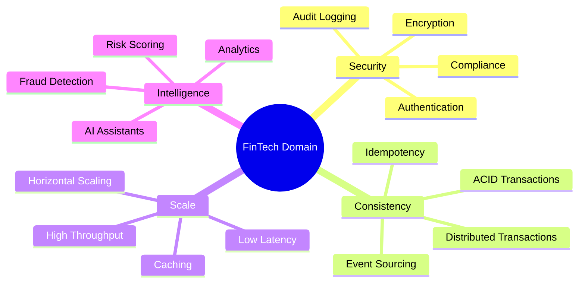

### Career Impact

```
Senior Engineer → Tech Lead → Software Architect
     ↑                ↑              ↑
   You are          Skills        Destination
    here           gained
```

**This project covers everything asked in Staff/Principal Engineer interviews at top tech companies.**

---

## Skills You'll Master

<div align="center">

### Technical Skills Matrix

</div>

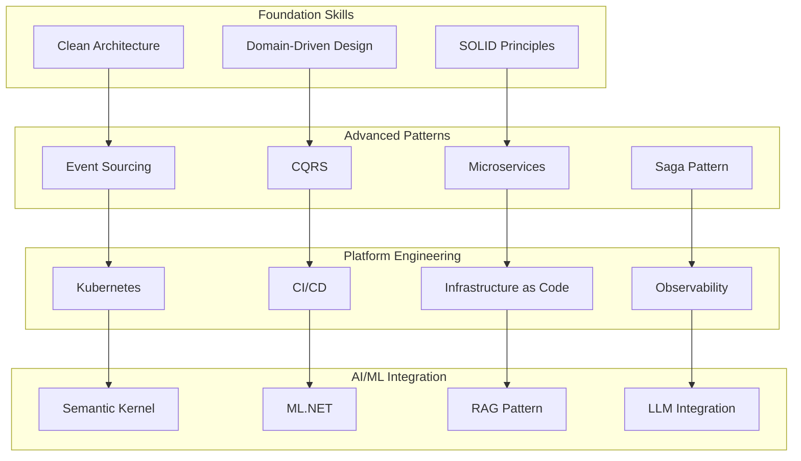

### Skills by Category

<details>
<summary><b>Software Architecture</b></summary>

| Skill | Level | Milestone |
|-------|-------|-----------|
| Clean Architecture | Advanced | 1 |
| Domain-Driven Design | Expert | 1-2 |
| Microservices Architecture | Advanced | 3 |
| Event-Driven Architecture | Expert | 2-3 |
| API Gateway Pattern | Intermediate | 3 |
| CQRS Pattern | Expert | 2 |
| Event Sourcing | Expert | 2 |
| Saga Pattern | Advanced | 3 |

</details>

<details>
<summary><b>Cloud & DevOps</b></summary>

| Skill | Level | Milestone |
|-------|-------|-----------|
| Docker | Advanced | 1 |
| Kubernetes | Advanced | 7 |
| Helm Charts | Intermediate | 7 |
| Terraform | Advanced | 7 |
| GitHub Actions | Advanced | 1 |
| GitOps (ArgoCD) | Intermediate | 7 |
| Observability (OpenTelemetry) | Advanced | 7 |

</details>

<details>
<summary><b>AI & Machine Learning</b></summary>

| Skill | Level | Milestone |
|-------|-------|-----------|
| Semantic Kernel | Advanced | 5 |
| ML.NET | Intermediate | 5 |
| RAG Pattern | Advanced | 5 |
| Anomaly Detection | Intermediate | 5 |
| LLM Integration | Advanced | 5 |

</details>

<details>
<summary><b>Security</b></summary>

| Skill | Level | Milestone |
|-------|-------|-----------|
| OAuth2/OIDC | Advanced | 1 |
| Data Encryption | Advanced | 6 |
| API Security | Advanced | 6 |
| Penetration Testing | Intermediate | 6 |
| Compliance (PCI, GDPR) | Intermediate | 6 |

</details>

---

## Architecture Overview

### System Context Diagram (C4 Level 1)

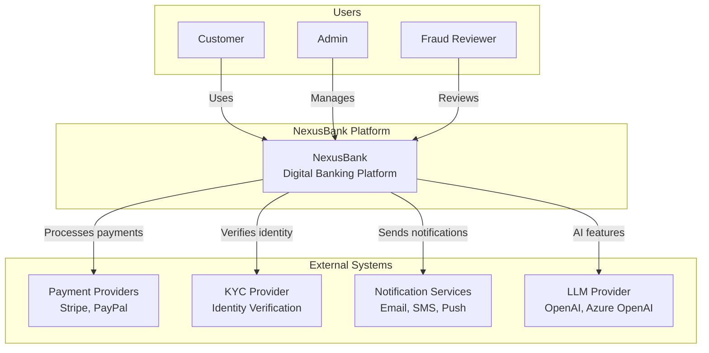

### Container Diagram (C4 Level 2)

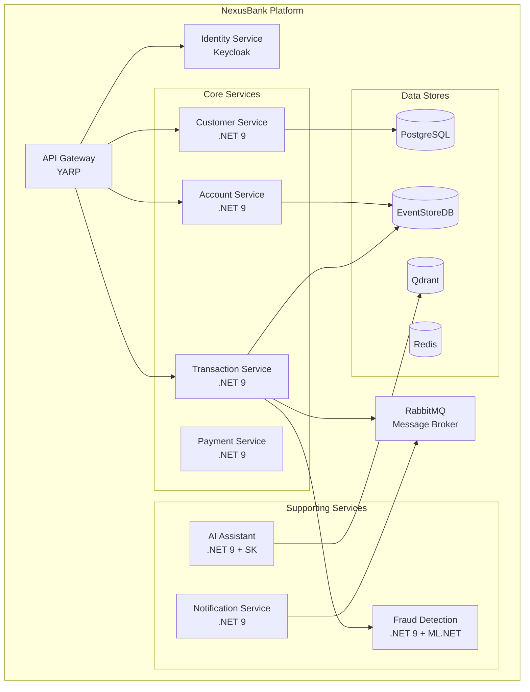

### Event-Driven Architecture Flow

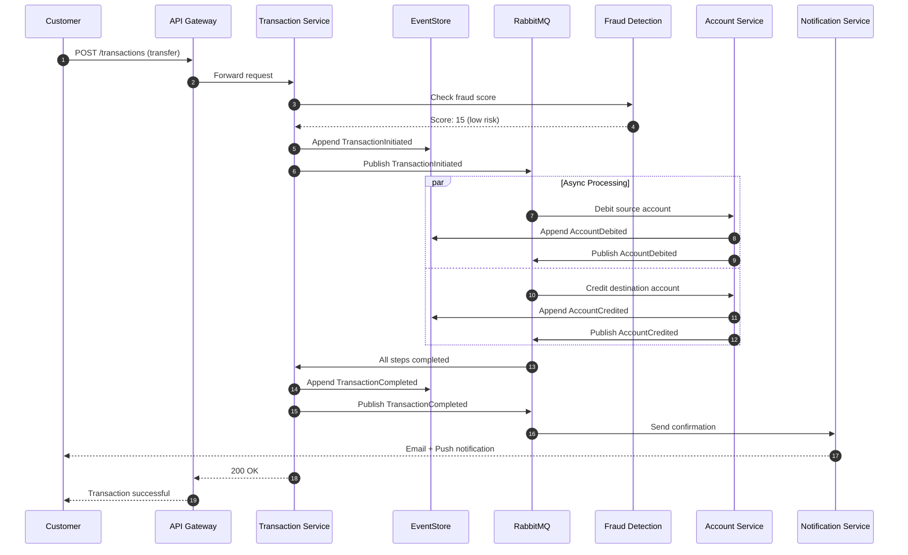

### Domain Model

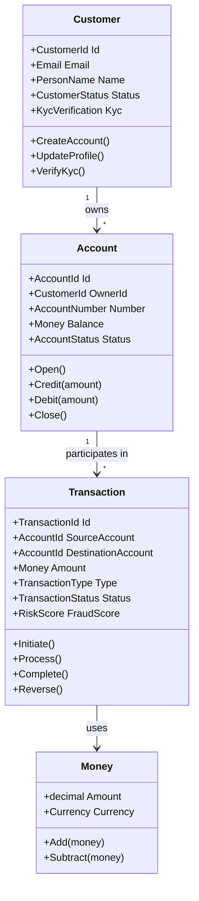

### Microservices Communication

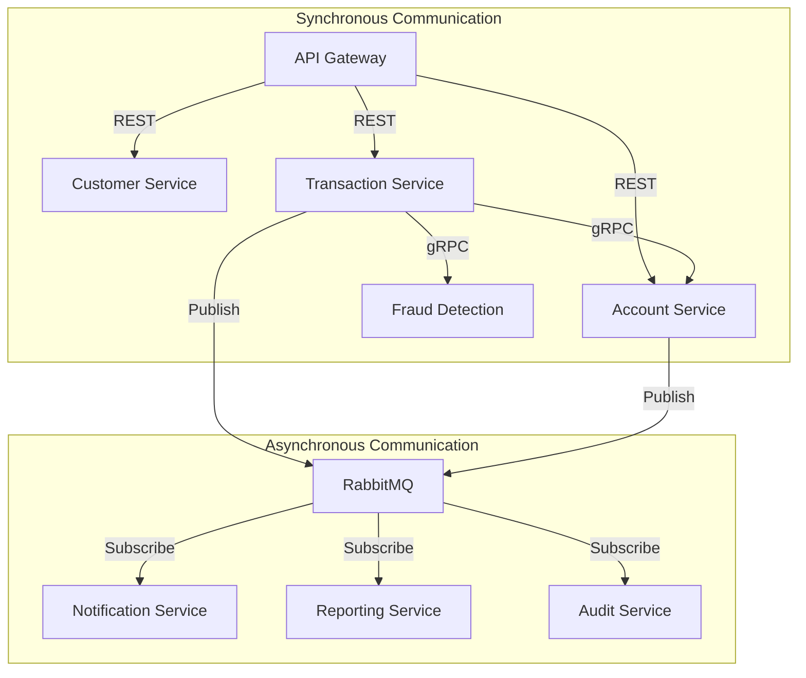

### Infrastructure Architecture

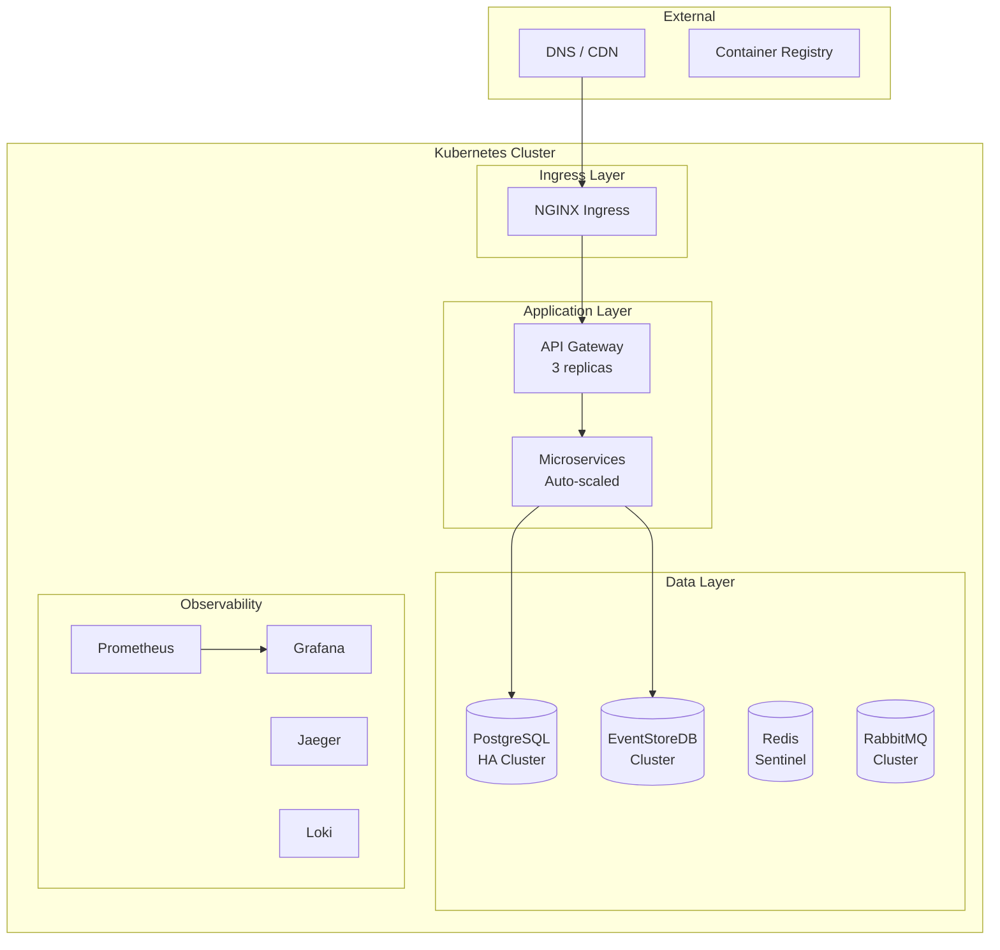

### CQRS & Event Sourcing Pattern

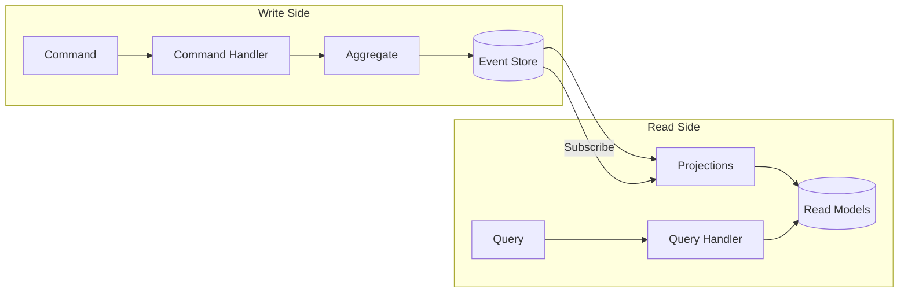

---

## Tech Stack

<div align="center">

### Core Technologies

[](https://dotnet.microsoft.com/)
[](https://docs.microsoft.com/en-us/dotnet/csharp/)
[](https://www.postgresql.org/)
[](https://redis.io/)
[](https://www.rabbitmq.com/)

### Cloud & DevOps

[](https://www.docker.com/)
[](https://kubernetes.io/)
[](https://www.terraform.io/)
[](https://github.com/features/actions)

### AI & Machine Learning

[](https://learn.microsoft.com/en-us/semantic-kernel/)
[](https://dotnet.microsoft.com/apps/machinelearning-ai/ml-dotnet)
[](https://openai.com/)

### Observability

[](https://opentelemetry.io/)
[](https://prometheus.io/)
[](https://grafana.com/)

</div>

### Complete Tech Stack Table

| Category | Technology | Purpose |
|----------|------------|---------|
| **Runtime** | .NET 9, C# 13 | Application framework |
| **Architecture** | Clean Architecture, DDD | Code organization |
| **API** | ASP.NET Core, gRPC, YARP | API layer |
| **Data** | PostgreSQL, EF Core | Relational data |
| **Events** | EventStoreDB | Event sourcing |
| **Cache** | Redis | Distributed caching |
| **Messaging** | RabbitMQ, MassTransit | Async messaging |
| **Identity** | Keycloak | Authentication/Authorization |
| **AI/ML** | Semantic Kernel, ML.NET | AI features |
| **Vector DB** | Qdrant | RAG embeddings |
| **Containers** | Docker, Kubernetes | Containerization |
| **IaC** | Terraform, Helm | Infrastructure as Code |
| **CI/CD** | GitHub Actions, ArgoCD | Automation |
| **Observability** | OpenTelemetry, Prometheus, Grafana, Jaeger | Monitoring |
| **Service Mesh** | Dapr | Cloud-agnostic abstractions |

---

## Getting Started

### Prerequisites

Before you begin, ensure you have the following installed:

```bash
# Required
dotnet --version      # .NET 9.0 SDK
docker --version      # Docker Desktop
git --version         # Git

# Recommended
kubectl version       # Kubernetes CLI
helm version          # Helm 3
terraform --version   # Terraform
```

### Installation

```bash
# 1. Clone the repository
git clone https://github.com/csa7mdm/NexusBank.git
cd NexusBank

# 2. Start infrastructure with Docker Compose
docker-compose up -d

# 3. Run database migrations
dotnet ef database update --project src/Infrastructure

# 4. Start the application
dotnet run --project src/Api

# 5. Open the API documentation
open http://localhost:5000/swagger
```

### Development Workflow

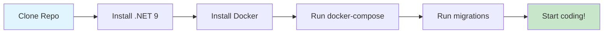

### Environment Configuration

Create a `.env` file in the root directory:

```env
# Database
POSTGRES_CONNECTION=Host=localhost;Database=nexusbank;Username=postgres;Password=postgres

# EventStore
EVENTSTORE_CONNECTION=esdb://localhost:2113?tls=false

# Redis
REDIS_CONNECTION=localhost:6379

# RabbitMQ
RABBITMQ_HOST=localhost
RABBITMQ_USER=guest
RABBITMQ_PASS=guest

# Keycloak
KEYCLOAK_URL=http://localhost:8080
KEYCLOAK_REALM=nexusbank

# AI (Optional)
OPENAI_API_KEY=your-key-here
```

---

## Learning Path

### Overview

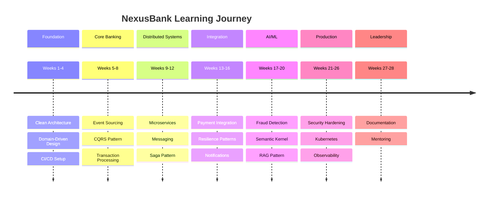

### Detailed Curriculum

<details>
<summary><h3>Milestone 1: Foundation (Weeks 1-4) - 12 Stories</h3></summary>

#### Sprint 1.1: Project Bootstrap & Clean Architecture

| Story | Title | Skills | Free Resource |
|-------|-------|--------|---------------|
| NB-001 | Set up monorepo with .NET Aspire | .NET Aspire | [Microsoft Learn: .NET Aspire](https://learn.microsoft.com/en-us/training/paths/dotnet-aspire/) |
| NB-002 | Implement Clean Architecture | SOLID, DI | [Clean Architecture Course](https://www.youtube.com/watch?v=dK4Yb6-LxAk) |
| NB-003 | Configure OpenTelemetry | Observability | [OpenTelemetry Docs](https://opentelemetry.io/docs/) |
| NB-004 | Set up GitHub Actions CI | CI/CD | [GitHub Actions Cert](https://resources.github.com/learn/certifications/) |
| NB-005 | Implement Result pattern | Functional | [Railway Programming](https://fsharpforfunandprofit.com/rop/) |
| NB-006 | Create DDD building blocks | DDD | [DDD Reference](https://www.domainlanguage.com/ddd/reference/) |

#### Sprint 1.2: Identity & Customer Domain

| Story | Title | Skills | Free Resource |
|-------|-------|--------|---------------|
| NB-007 | Integrate Keycloak | OAuth2, OIDC | [Keycloak Docs](https://www.keycloak.org/documentation) |
| NB-008 | Implement Customer aggregate | DDD Aggregates | [Aggregate Design](https://www.dddcommunity.org/library/vernon_2011/) |
| NB-009 | Customer onboarding workflow | Domain Services | Free |
| NB-010 | KYC verification service | Anti-corruption Layer | Free |
| NB-011 | Domain validation | Specification Pattern | Free |
| NB-012 | Domain unit tests | Testing | [xUnit Docs](https://xunit.net/) |

**Key Deliverables:**
- Scaffolded solution with CI
- Basic observability
- Customer management with identity
- 80%+ test coverage

</details>

<details>
<summary><h3>Milestone 2: Account & Transaction Core (Weeks 5-8) - 12 Stories</h3></summary>

#### Sprint 2.1: Event Sourcing

| Story | Title | Skills | Free Resource |
|-------|-------|--------|---------------|
| NB-013 | Set up EventStoreDB | Event Store | [EventStoreDB Academy](https://academy.eventstore.com/) |
| NB-014 | Account aggregate with events | Event Sourcing | [Event Sourcing Intro](https://eventstore.com/event-sourcing/) |
| NB-015 | Account lifecycle events | Event Design | Free |
| NB-016 | Optimistic concurrency | Concurrency | Free |
| NB-017 | Snapshots | Performance | Free |
| NB-018 | Account projections | CQRS | Free |

#### Sprint 2.2: Transaction Processing

| Story | Title | Skills | Free Resource |
|-------|-------|--------|---------------|
| NB-019 | Transaction aggregate | State Machine | Free |
| NB-020 | Debit/credit operations | Double-entry | Free |
| NB-021 | Transaction rules | Rule Engine | Free |
| NB-022 | Idempotency | Distributed Systems | Free |
| NB-023 | Transaction projections | Query Optimization | Free |
| NB-024 | Balance calculations | Consistency | Free |

**Key Deliverables:**
- Event-sourced account management
- CQRS separation
- Robust transaction processing
- Complete audit trail

</details>

<details>
<summary><h3>Milestone 3: Distributed Systems (Weeks 9-12) - 12 Stories</h3></summary>

#### Sprint 3.1: Service Decomposition

| Story | Title | Skills | Free Resource |
|-------|-------|--------|---------------|
| NB-025 | Extract Account service | Bounded Contexts | Free |
| NB-026 | Extract Transaction service | Service Communication | Free |
| NB-027 | API Gateway with YARP | Gateway Pattern | [YARP Docs](https://microsoft.github.io/reverse-proxy/) |
| NB-028 | Dapr integration | Service Mesh | [Dapr Certification](https://www.diagrid.io/dapr-certification) |
| NB-029 | Distributed configuration | Config Management | Free |
| NB-030 | Health checks | Readiness/Liveness | Free |

#### Sprint 3.2: Event-Driven Integration

| Story | Title | Skills | Free Resource |
|-------|-------|--------|---------------|
| NB-031 | RabbitMQ setup | Message Brokers | [RabbitMQ Tutorials](https://www.rabbitmq.com/getstarted.html) |
| NB-032 | Domain event publishing | Pub/Sub | Free |
| NB-033 | Money transfer Saga | Distributed Transactions | [MassTransit Sagas](https://masstransit-project.com/usage/sagas/) |
| NB-034 | Outbox pattern | Reliable Messaging | Free |
| NB-035 | Dead letter handling | Error Handling | Free |
| NB-036 | Event contracts | Schema Evolution | Free |

**Key Deliverables:**
- Microservices architecture
- API Gateway
- Reliable event-driven communication

</details>

<details>
<summary><h3>Milestone 4: Payment Gateway (Weeks 13-16) - 12 Stories</h3></summary>

#### Sprint 4.1: Payment Integration

| Story | Title | Skills | Free Resource |
|-------|-------|--------|---------------|
| NB-037 | Payment abstraction | Adapter Pattern | Free |
| NB-038 | Stripe integration | Payment APIs | [Stripe Docs](https://stripe.com/docs) |
| NB-039 | Webhook handling | Webhook Security | Free |
| NB-040 | Circuit breaker | Polly | [Polly Docs](https://github.com/App-vNext/Polly) |
| NB-041 | Retry policies | Resilience | Free |
| NB-042 | Reconciliation | Data Consistency | Free |

#### Sprint 4.2: Notifications & Reporting

| Story | Title | Skills | Free Resource |
|-------|-------|--------|---------------|
| NB-043 | Notification service | System Design | Free |
| NB-044 | Multi-channel notifications | Provider Abstraction | Free |
| NB-045 | Real-time updates | SignalR | [SignalR Docs](https://docs.microsoft.com/en-us/aspnet/core/signalr/) |
| NB-046 | Statement generation | Background Jobs | [Hangfire](https://www.hangfire.io/) |
| NB-047 | Reporting warehouse | OLAP | Free |
| NB-048 | Grafana dashboards | Visualization | [Grafana Tutorials](https://grafana.com/tutorials/) |

**Key Deliverables:**
- Production-ready payment integration
- Complete notification system
- Operational dashboards

</details>

<details>
<summary><h3>Milestone 5: AI/ML Integration (Weeks 17-20) - 12 Stories</h3></summary>

#### Sprint 5.1: Fraud Detection

| Story | Title | Skills | Free Resource |
|-------|-------|--------|---------------|
| NB-049 | Fraud detection pipeline | ML Architecture | Free |
| NB-050 | Rule-based checks | Rule Engine | Free |
| NB-051 | ML.NET anomaly detection | ML.NET | [ML.NET Learning Path](https://learn.microsoft.com/en-us/training/paths/machine-learning-dotnet/) |
| NB-052 | Real-time scoring | Model Serving | Free |
| NB-053 | Risk scoring | Feature Engineering | Free |
| NB-054 | Review workflow | Human-in-loop | Free |

#### Sprint 5.2: AI Assistant

| Story | Title | Skills | Free Resource |
|-------|-------|--------|---------------|
| NB-055 | Semantic Kernel setup | LLM Orchestration | [SK Learning Path](https://learn.microsoft.com/en-us/training/paths/semantic-kernel/) |
| NB-056 | Banking plugins | Function Calling | Free |
| NB-057 | RAG for policies | Vector Search | [RAG Guide](https://www.pinecone.io/learn/retrieval-augmented-generation/) |
| NB-058 | NL transaction queries | NL2SQL | Free |
| NB-059 | Spending insights | Personalization | Free |
| NB-060 | Support chat | Conversational AI | Free |

**Key Deliverables:**
- ML-powered fraud detection
- AI-powered banking assistant
- RAG-based policy queries

</details>

<details>
<summary><h3>Milestone 6: Security & Compliance (Weeks 21-22) - 6 Stories</h3></summary>

#### Sprint 6.1: Security Hardening

| Story | Title | Skills | Free Resource |
|-------|-------|--------|---------------|
| NB-061 | Field encryption | Cryptography | [OWASP Crypto](https://cheatsheetseries.owasp.org/cheatsheets/Cryptographic_Storage_Cheat_Sheet.html) |
| NB-062 | Audit logging | Compliance | Free |
| NB-063 | Rate limiting | API Security | Free |
| NB-064 | Request signing | HMAC | Free |
| NB-065 | Penetration testing | OWASP | [OWASP Testing Guide](https://owasp.org/www-project-web-security-testing-guide/) |
| NB-066 | PII masking | Data Privacy | Free |

**Key Deliverables:**
- Security-hardened system
- Compliance controls
- Penetration testing suite

</details>

<details>
<summary><h3>Milestone 7: Platform Engineering (Weeks 23-26) - 12 Stories</h3></summary>

#### Sprint 7.1: Kubernetes & IaC

| Story | Title | Skills | Free Resource |
|-------|-------|--------|---------------|
| NB-067 | Kubernetes manifests | K8s | [K8s Tutorials](https://kubernetes.io/docs/tutorials/) |
| NB-068 | Helm charts | Package Management | [Helm Docs](https://helm.sh/docs/) |
| NB-069 | Terraform | IaC | [Terraform Tutorials](https://developer.hashicorp.com/terraform/tutorials) |
| NB-070 | Autoscaling | HPA | Free |
| NB-071 | GitOps with ArgoCD | GitOps | [GitOps Fundamentals](https://learning.codefresh.io/) |
| NB-072 | Disaster recovery | DR/BCP | Free |

#### Sprint 7.2: Observability & SRE

| Story | Title | Skills | Free Resource |
|-------|-------|--------|---------------|
| NB-073 | Distributed tracing | Tracing | Free |
| NB-074 | SLIs and SLOs | SRE | [Google SRE Book](https://sre.google/sre-book/table-of-contents/) |
| NB-075 | Alerting rules | On-call | Free |
| NB-076 | Log aggregation | Logging | Free |
| NB-077 | Performance benchmarks | Load Testing | [k6 Docs](https://k6.io/docs/) |
| NB-078 | Chaos engineering | Resilience | [Chaos Engineering](https://principlesofchaos.org/) |

**Key Deliverables:**
- Production Kubernetes deployment
- GitOps workflow
- Full observability stack

</details>

<details>
<summary><h3>Milestone 8: Leadership (Weeks 27-28) - 6 Stories</h3></summary>

#### Sprint 8.1: Documentation & Mentoring

| Story | Title | Skills | Free Resource |
|-------|-------|--------|---------------|
| NB-079 | ADRs | Decision Documentation | [ADR GitHub](https://adr.github.io/) |
| NB-080 | C4 diagrams | Architecture Visualization | [C4 Model](https://c4model.com/) |
| NB-081 | OpenAPI docs | API Documentation | [OpenAPI Spec](https://swagger.io/specification/) |
| NB-082 | Onboarding guide | Technical Writing | [Google Tech Writing](https://developers.google.com/tech-writing) |
| NB-083 | Architecture videos | Presentation | Free |
| NB-084 | Code review workshops | Mentoring | [Google Code Review](https://google.github.io/eng-practices/review/) |

**Key Deliverables:**
- Complete documentation
- Architecture decision records
- Ready for team scaling

</details>

---

## Free Certifications & Badges

### Certification Roadmap

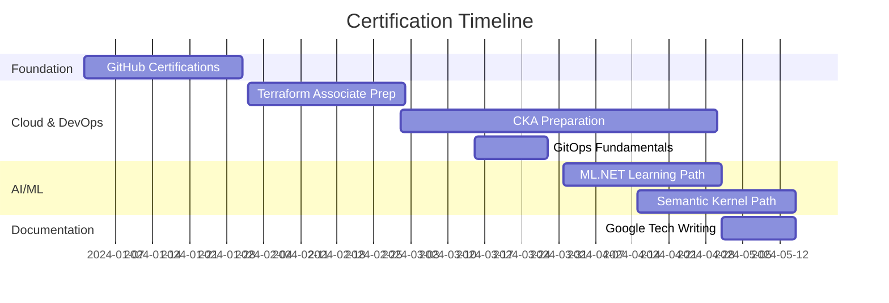

### Free Certifications Table

| Certification | Provider | Cost | Topic | Link |
|--------------|----------|------|-------|------|
| **GitHub Foundations** | GitHub | FREE | Git & GitHub | [Get Certified](https://resources.github.com/learn/certifications/) |
| **GitHub Actions** | GitHub | FREE | CI/CD | [Get Certified](https://resources.github.com/learn/certifications/) |
| **Terraform Associate Prep** | HashiCorp | FREE | IaC | [Study Guide](https://developer.hashicorp.com/terraform/tutorials/certification-003) |
| **Dapr Certification** | Diagrid | FREE | Service Mesh | [Get Certified](https://www.diagrid.io/dapr-certification) |
| **GitOps Fundamentals** | Codefresh | FREE | GitOps | [Get Certified](https://learning.codefresh.io/) |
| **Grafana Fundamentals** | Grafana Labs | FREE | Observability | [Training](https://grafana.com/tutorials/) |
| **Google Tech Writing** | Google | FREE | Documentation | [Course](https://developers.google.com/tech-writing) |
| **EventStoreDB Academy** | Event Store | FREE | Event Sourcing | [Academy](https://academy.eventstore.com/) |
| **ML.NET Learning Path** | Microsoft | FREE | Machine Learning | [Learn](https://learn.microsoft.com/en-us/training/paths/machine-learning-dotnet/) |
| **Semantic Kernel Path** | Microsoft | FREE | AI/LLM | [Learn](https://learn.microsoft.com/en-us/training/paths/semantic-kernel/) |
| **.NET Aspire Path** | Microsoft | FREE | .NET | [Learn](https://learn.microsoft.com/en-us/training/paths/dotnet-aspire/) |
| **OpenTelemetry** | CNCF | FREE | Observability | [Training](https://www.cncf.io/training/) |

### Skill Badges

<div align="center">

#### Microsoft Learn Achievements
[](https://learn.microsoft.com/en-us/certifications/azure-fundamentals/)
[](https://learn.microsoft.com/en-us/training/)

#### Linux Foundation
[](https://training.linuxfoundation.org/certification/certified-kubernetes-administrator-cka/)

#### HashiCorp
[](https://www.hashicorp.com/certification/terraform-associate)

</div>

---

## Project Structure

```
NexusBank/
├── .github/
│   ├── workflows/           # GitHub Actions CI/CD
│   └── ISSUE_TEMPLATE/      # Issue templates
├── docs/
│   ├── adr/                 # Architecture Decision Records
│   ├── diagrams/            # C4 and other diagrams
│   └── api/                 # API documentation
├── src/
│   ├── BuildingBlocks/      # Shared kernel
│   │   ├── Domain/          # Base entities, value objects
│   │   ├── Application/     # Common application concerns
│   │   └── Infrastructure/  # Shared infrastructure
│   ├── Services/
│   │   ├── Customer/        # Customer bounded context
│   │   │   ├── Customer.Domain/
│   │   │   ├── Customer.Application/
│   │   │   ├── Customer.Infrastructure/
│   │   │   └── Customer.Api/
│   │   ├── Account/         # Account bounded context
│   │   ├── Transaction/     # Transaction bounded context
│   │   ├── Payment/         # Payment bounded context
│   │   ├── Notification/    # Notification service
│   │   ├── FraudDetection/  # ML-based fraud detection
│   │   └── AIAssistant/     # Semantic Kernel AI service
│   ├── ApiGateway/          # YARP API Gateway
│   └── AppHost/             # .NET Aspire orchestration
├── tests/
│   ├── UnitTests/
│   ├── IntegrationTests/
│   ├── ArchitectureTests/
│   └── LoadTests/
├── deploy/
│   ├── docker/              # Docker Compose files
│   ├── kubernetes/          # K8s manifests
│   ├── helm/                # Helm charts
│   └── terraform/           # Infrastructure as Code
├── docker-compose.yml
├── docker-compose.override.yml
└── NexusBank.sln
```

---

## Roadmap

### Progress Tracking

| Milestone | Stories | Status |
|-----------|---------|--------|
| 1. Foundation | 12 | Not Started |
| 2. Transactions | 12 | Not Started |
| 3. Distributed | 12 | Not Started |
| 4. Payments | 12 | Not Started |
| 5. AI/ML | 12 | Not Started |
| 6. Security | 6 | Not Started |
| 7. Platform | 12 | Not Started |
| 8. Leadership | 6 | Not Started |
| **Total** | **84** | **0% Complete** |

### Future Enhancements

- [ ] Multi-tenancy support
- [ ] GraphQL API option
- [ ] Mobile app (MAUI)
- [ ] Blockchain integration
- [ ] Real-time analytics dashboard
- [ ] A/B testing framework

---

## Contributing

We welcome contributions! This project is designed for learning, and contributions help everyone.

### How to Contribute

1. Fork the repository
2. Create a feature branch (`git checkout -b feature/amazing-feature`)
3. Commit your changes (`git commit -m 'Add amazing feature'`)
4. Push to the branch (`git push origin feature/amazing-feature`)
5. Open a Pull Request

### Contribution Areas

- Code implementations for user stories
- Documentation improvements
- Bug fixes
- Test coverage
- Translations

---

## Resources

### Recommended Books

| Book | Author | Topic |
|------|--------|-------|
| Domain-Driven Design | Eric Evans | DDD Fundamentals |
| Implementing DDD | Vaughn Vernon | DDD Patterns |
| Clean Architecture | Robert C. Martin | Architecture |
| Building Microservices | Sam Newman | Microservices |
| Designing Data-Intensive Applications | Martin Kleppmann | Distributed Systems |
| Site Reliability Engineering | Google | SRE Practices |

### Online Learning

- [.NET Microservices Architecture](https://learn.microsoft.com/en-us/dotnet/architecture/microservices/)
- [Event Sourcing in .NET](https://www.eventstore.com/event-sourcing)
- [Kubernetes Basics](https://kubernetes.io/docs/tutorials/kubernetes-basics/)
- [Semantic Kernel Workshop](https://learn.microsoft.com/en-us/semantic-kernel/)

### Communities

- [.NET Discord](https://discord.gg/dotnet)
- [DDD Community](https://www.dddcommunity.org/)
- [CNCF Slack](https://slack.cncf.io/)

---

## License

Distributed under the MIT License. See `LICENSE` for more information.

---

## Author

<div align="center">

**Ahmed Mustafa**

.NET Architect | AI Agent Engineer | Cloud Native

[](https://linkedin.com/in/csa7mdm)
[](https://github.com/csa7mdm)

---

**If this project helped you, please consider giving it a star!**

[](https://github.com/csa7mdm/NexusBank)

</div>

---

<div align="center">

### Keywords

`dotnet` `csharp` `clean-architecture` `ddd` `domain-driven-design` `event-sourcing` `cqrs` `microservices` `kubernetes` `docker` `terraform` `gitops` `ci-cd` `github-actions` `semantic-kernel` `ml-net` `ai` `machine-learning` `llm` `opentelemetry` `observability` `fintech` `banking` `software-architecture` `tech-lead` `staff-engineer` `principal-engineer` `learning-path` `roadmap` `free-certification`

---

<sub>Built with passion for the .NET community</sub>

</div>
